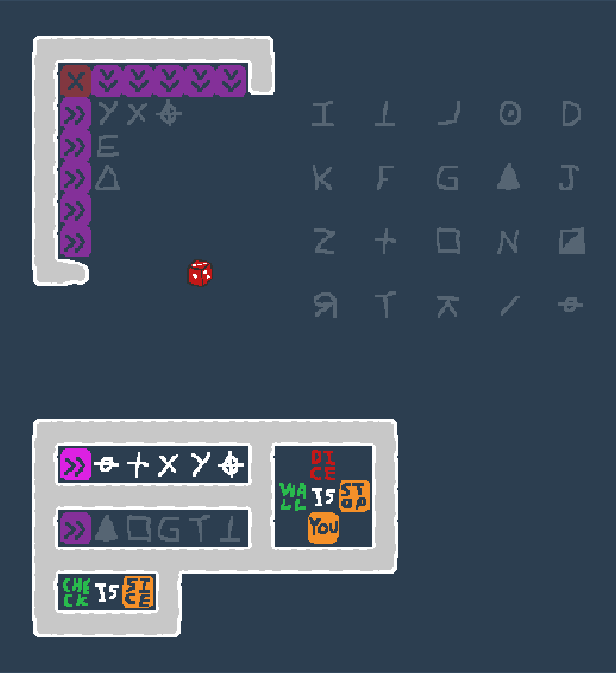
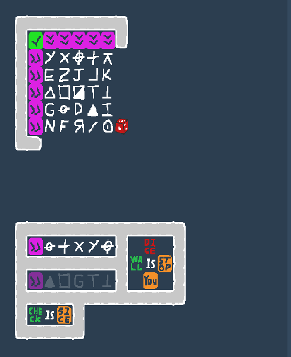

# DiceCTF 2021 - Dice is you
```
DICE IS YOU

Controls:

wasd/arrows: movement
space: advance a tick without moving
q: quit to main menu
r: restart current level
z: undo a move (only works for past 256 moves and super buggy)

Play: dice-is-you.dicec.tf
```

Points: 251

Solves: 19

Tags: rev, misc, game

## Initial steps
We are given a clone of the amazing game Baba is You. The first four levels are little logic puzzles we can solve quickly.
On the fifth level we are presented the following:



We immediatly assume that the leftover 20 symbols have to be sorted into the 5x5 grid by the pink arrows to make all rows/columns light up. After playing around a bit we go over to reversing the game.

## Decompiling WebAssembly
The game is given as compiled WebAssembly. We use [the decompiler from wabt](https://github.com/WebAssembly/wabt/blob/master/docs/decompiler.md) to decompile the WebAssembly binary. Since it spits out C-like code we give it the .c extension to get neat syntax highlighting in VSCode.

```bash
bin/wasm-decompile app.wasm -o out.c
```

We get a huge output file, containing many standard/SDL/emscripten functions.
To make finding interesting functions a bit easier we create a seperate file containing just the function names, excluding the boilerplate:

```
cat out.c | grep function | grep -v "SDl" | grep -v "emscripten" > functions.txt
```

Some interesting ones:
```
function win_level()
function main_loop() 
function check_code(a:int, b:int, c:int, d:int):int 
function check_rule(a:int, b:int, c:int, d:int, e:int, f:int, g:int, h:int):int 
function check_win_condition(a:int, b:int, c:int):int 

function level1() 
function level2() 
function level3() 
function level4() 
function level_flag_fin() 
```

## Finding the critical functions
We can assume a lot about the functionality of the game just from the function names. A quick look at the *level* functions suggests that they hold logic for initializing the level (spawning entities).

We find constructs like this:
```c
var m:int = 2;
var n:int = 8;
var o:int = -2;
var p:int = 7;
var q:int = 6;
var r:int = 342;
spawn_entity(m, m, r);
spawn_entity(d, d, o);
spawn_entity(m, d, o);
spawn_entity(e, d, o);
spawn_entity(h, d, o);
```

I wrote a small script to replace the variables in the calls with their values to deduce the functionality. It quickly becomes clear that the three parameters are likely: x,y,entity_id where 0,0 is the top left corner. Using this assumptions we map entity-ids to symbols for the flag level:

```
spawn_entity(2, 14, 270); // pink arrows
spawn_entity(3, 14, 210); // balance
spawn_entity(4, 14, 174); // +
spawn_entity(5, 14, 324); // x
spawn_entity(6, 14, 330); // y
spawn_entity(7, 14, 198); // crosshair
spawn_entity(2, 16, 270); // pink arrows
spawn_entity(3, 16, 300); // filled traingle
spawn_entity(4, 16, 186); // square
spawn_entity(5, 16, 348); // G
spawn_entity(6, 16, 234); // T
spawn_entity(7, 16, 276); // T, turned over
spawn_entity(10, 14, 27); // DICE
spawn_entity(10, 15, 0); // IS
spawn_entity(10, 16, 6); // YOU
spawn_entity(9, 15, 15); // WALL
spawn_entity(11, 15, 18); // STOP
spawn_entity(2, 18, 45); // CHECK
spawn_entity(3, 18, 0); // IS
spawn_entity(4, 18, 30); // SICE
spawn_entity(16, 3, 240); // O with dot in middle
spawn_entity(18, 3, 252); // D, mirrored
spawn_entity(10, 3, 294); // I
spawn_entity(12, 3, 276); // T, turned over
spawn_entity(14, 3, 288); // L, mirrored
spawn_entity(16, 5, 300); // filled triangle
spawn_entity(18, 5, 312); // J
spawn_entity(10, 5, 306); // K
spawn_entity(12, 5, 318); // F
spawn_entity(14, 5, 348); // G
spawn_entity(16, 7, 336); // N
spawn_entity(18, 7, 150); // half-filled square
spawn_entity(10, 7, 162); // Z
spawn_entity(12, 7, 174); // +
spawn_entity(14, 7, 186); // square
spawn_entity(16, 9, 258); // slash
spawn_entity(18, 9, 210); // balance
spawn_entity(10, 9, 222); // R, mirrored
spawn_entity(12, 9, 234); // T
spawn_entity(14, 9, 246); // arrow up with bar on top
```

Continuing we look for functions that could implement the check for the pink arrows. ```code(a, b, c, d, e)``` looks very suspicious (comments created by me):
```c
function code(a:int, b:int, c:int, d:int, e:int):int {
  var f:int = g_a;
  var g:int = 16;
  var h:int = f - g;
  h[15]:byte = a;
  h[14]:byte = b;
  h[13]:byte = c;
  h[12]:byte = d;
  h[11]:byte = e;
  var i:int = h[15]:ubyte;
  var j:int = 255;
  var k:int = a & j;
  var l:int = 42;
  var m:int = k * l; // m = a*42
  var n:int = h[14]:ubyte;
  var o:int = 255;
  var p:int = n & o;
  var q:int = 1337;
  var r:int = p * q; // r = b * 1337
  var s:int = m + r;
  var t:int = h[13]:ubyte;
  var u:int = 255;
  var v:int = t & u;
  var w:int = s + v; // w = (m+r) + c
  var x:int = h[13]:ubyte;
  var y:int = 255;
  var z:int = x & y;
  var aa:int = h[12]:ubyte;
  var ba:int = 255;
  var ca:int = aa & ba;
  var da:int = z ^ ca; // da = c ^ d
  var ea:int = w + da; // ea = (m+r) + c + (c^d)
  var fa:int = h[11]:ubyte;
  var ga:int = 255;
  var ha:int = fa & ga; 
  var ia:int = 1;
  var ja:int = ha << ia; // ja = e << 1
  var ka:int = ea + ja; // ka = (m+r) + c + (c^d) + (e << 1)
  var la:int = 255;
  var ma:int = ka & la;
  return ma; // 8bit-result = (a*42+b*1337) + c + (c^d) + (e << 1)
}
```

It looks very much like the functions is given a value for each symbol of a completed row/column and is applying some operations on them to generate a code value.

Now we need to know two more things:
- What is the desirable result of this function for a correct row/column?
- What is the value of each of our symbols?

To answer the first questions we check where ```code(a, b, c, d, e)``` is called and how its return value is used.

The only spot where it is used is inside ```check_code()```. Perfect! We can see that the return value is used as an if-condition. A positive results thus has to be either 0 or not-0.
```c
var db:int = code(ua, wa, ya, ab, cb);
g[6]:byte = db;
var eb:int = g[6]:ubyte;
var fb:int = 255;
var gb:int = eb & fb;
if (gb) goto B_f;
```

Next I tried to deduce the values of the symbols. My first idea was that the value of the symbol is equal to its entity_id. Then I discovered that the value is calculated in the function ```get_code_value(a)```, where 138 is substracted from input a. From this function we can deduce all possible code values:
```c
var j:int = 1;  
var k:int = 5; 
var l:int = 18;  
var m:int = 25; 
var n:int = 48; 
var o:int = 49; 
var p:int = 55; 
var q:int = 61; 
var r:int = 96; 
var s:int = 119; 
var t:int = 120; 
var u:int = 135; 
var v:int = 138; 
var w:int = 148; 
var x:int = 150; 
var y:int = 160; 
var z:int = 163; 
var aa:int = 171;
var ba:int = 179;
var ca:int = 183;
var da:int = 189;
var ea:int = 192;
var fa:int = 194;
var ga:int = 212;
var ha:int = 247;
```

However they do not quite line-up with the entity-ids, even after substracting 138. Since the decompilation is very bad, I switched to dynamical reversing by using the Chrome Debugger.

## Finding symbol values using the Chrome Debugger
After googling for Chrome WASM Debugging, I turned on *DWARF Support* in the Experimental settings of the Chrome Development Console.

When clicking on the WASM file in the *Sources* tab I can search and find functions. yay! We set a breakpoint at the end of the ```code(a, b, c, d, e)``` function and set watches for the input and output values. By building one row at a time we deduce the values for all symbols. I also deduce that 0 is the positive result.

```
var j:int = 1;  // mirrored L
var k:int = 5; // mirrored R
var l:int = 18;  // O with dot in middle
var m:int = 25; // D
var n:int = 48; // E
var o:int = 49; // F
var p:int = 55; // turned-over T
var q:int = 61; // filled triangle
var r:int = 96; // G
var s:int = 119; // half-filled square
var t:int = 120; // I
var u:int = 135; // J
var v:int = 138; // K
var w:int = 148; // N
var x:int = 150; // Arrow with line above
var y:int = 160; // +
var z:int = 163; // /
var aa:int = 171; // balance
var ba:int = 179; // square
var ca:int = 183; // T
var da:int = 189; // crosshair
var ea:int = 192; // triangle
var fa:int = 194; // X
var ga:int = 212; // Y
var ha:int = 247; // Z
```

Now we "just" need to find a 5x5 configuration that (presumably) encodes to 0 for each row and column.

## Finding a configuration using Constraint Solving (Z3)
Initially we tried to find a solution using bruteforce. However that quickly turned out to be infeasible. Thus we turn to constraint solving using [Z3](https://github.com/Z3Prover/z3).

We have 25 variables for each position of the 5x5 grid. Their domain is the list of symbol values found above.

We also have the following constraints:
- ```code(a,b,c,d,e) == 0``` for each row
- ```code(a,b,c,d,e) == 0``` for each column
- All variables are distinct

This script solves the problem (we had already solved the first row/column):
```python
from z3 import *

possible_candidates = [
    1,5,18,25,49,55,61,119,120,135,138,
    163,171,179,183,247
]


grid = [
    [212,194,189,160,150],
    [48,0,0,0,0],
    [192,0,0,0,0],
    [96,0,0,0,0],
    [148,0,0,0,0],
]

def check_row(ans_grid, i):
    return code_check(ans_grid[i][0], ans_grid[i][1], ans_grid[i][2], ans_grid[i][3], ans_grid[i][4])

def check_column(ans_grid, i):
    return code_check(ans_grid[0][i], ans_grid[1][i], ans_grid[2][i], ans_grid[3][i], ans_grid[4][i])

def code_check(a, b, c, d, e):
    return (((a*42+b*1337) + c + (c^d) + (e << 1)) & 255) == 0


a = BitVec('a',8)
b = BitVec('b',8)
c = BitVec('c',8)
d = BitVec('d',8)

e = BitVec('e',8)
f = BitVec('f',8)
g = BitVec('g',8)
h = BitVec('h',8)

i = BitVec('i',8)
j = BitVec('j',8)
k = BitVec('k',8)
l = BitVec('l',8)

m = BitVec('m',8)
n = BitVec('n',8)
o = BitVec('o',8)
p = BitVec('p',8)

vs = [a,b,c,d,e,f,g,h,i,j,k,l,m,n,o,p]

s = Solver()

# Row Constraints
s.add(code_check(48, a, b, c, d))
s.add(code_check(192, e, f, g, h))
s.add(code_check(96, i, j, k, l))
s.add(code_check(148, m, n, o, p))

# Column Constraints
s.add(code_check(194, a, e, i, m))
s.add(code_check(189, b, f, j, n))
s.add(code_check(160, c, g, k, o))
s.add(code_check(150, d, h, l, p))

# All distinct constraint
s.add(Distinct(vs))

# Variable Domain constraint
for v in vs:
    b = []
    for pc in possible_candidates:
        b.append(v == pc)
    s.add(Or(b))


print(s.check())
print(s.model())
```

This spits out:
```
[p = 18,
 d = 138,
 k = 61,
 n = 5,
 h = 55,
 e = 179,
 j = 25,
 o = 163,
 i = 171,
 f = 119,
 b = 135,
 a = 247,
 g = 183,
 l = 120,
 m = 49,
 c = 1]
```

## Flag
Now all that is left to do is to arrange the symbols and hopefully get the flag:



It works!

```
dice{d1ce_1s_y0u_is_th0nk_73da6}
```

Many thanks to the challenge author *hgarrereyn* for creating such a cool challenge for one of my favorite games! Also thanks to my teammate *zzz* for helping me on the way!

