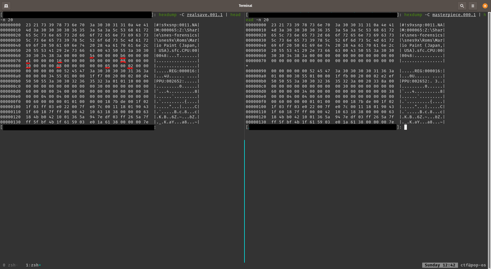
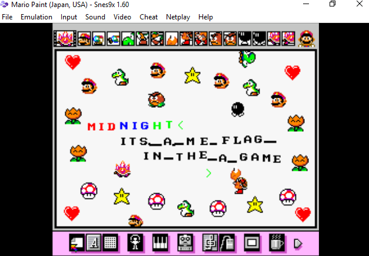

# Midnight Sun CTF 2020 Qualifier - Masterpiece
> You have to help. I'm really devestated now. I was making this really beautiful piece of art and had it saved and everything but now when I try to look at it everything just crashes. I'm really sad about this.

Download: [https://s3-eu-west-1.amazonaws.com/2020.midnightsunctf.se/865100d0d994d6fd36c3a398c46528f93a0069dd2f613c50955ffe47ca452e6b/masterpiece-dist.tgz](https://s3-eu-west-1.amazonaws.com/2020.midnightsunctf.se/865100d0d994d6fd36c3a398c46528f93a0069dd2f613c50955ffe47ca452e6b/masterpiece-dist.tgz)

Points: 78

Solves: 115

Tags: forensic

## Initial Steps
We unpack the archive. We find a file *masterpiece.000* in the folder. What is it?
```bash
$ file masterpiece.000
masterpiece.000: gzip compressed data, max compression, original size modulo 2^32 1164472
```

Another archive. Let's unpack it. We get another file *masterpiece.000.1*. What is it?
```bash
$ file masterpiece.000.1
masterpiece.000.1: data
```

## Recon on the file

Ok. Let's see if there is any text inside. Pipe it into head, since there seems to be a lot.

```bash
$ strings masterpiece.000.1 | head -n 10
#!s9xsnp:0011
NAM:000065:Z:\Share\snes-forensics\snes9x\Roms\Mario Paint (Japan, USA).sfc
CPU:000048:
REG:000016:
PPU:002652:
TUUUUUUUUUUUUUUUUUUUUUUUUUUUUUUU
5yDMA:000152:
VRA:065536:
00AA
?3}Qp@OO??
```

Interesting. Googling reveals that snes9x is a Super Nintendo emulator. Maybe this is a savestate from the crashed game of Mario Paint? The .000 ending supports that.

## Loading the savestate into the game
To be able to load the savestate we do the following:

1. **Install Snes9x.** Since it didn't run on my OS I downloaded a Windows 10 Vagrant Box and installed it there.
2. **Download the ROM:** Mario Paint (Japan, USA)
3. **Start the ROM** and **Load the savestate**

Running the game in the emulator works. However it crashes when loading the savestate. Is it corrupted?

## Fixing the savestate
To check whether the savestate is corrupted we make another valid savestate using snes9x. Then we can compare them using hexdump (after unpacking the real savestate):



Notice how the bytes marked red are missing in the corrupted savestate. We use *dd* to fix that. For example:
```bash
printf '\x54' | dd of=masterpiece.000.1 bs=1 seek=$((0x00000068)) conv=notrunc
```

After patching the savestate we try to load it in snes9x again. It works!

