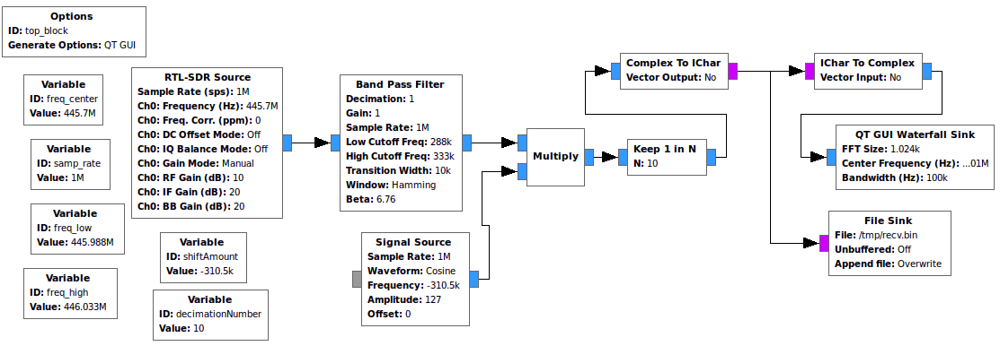
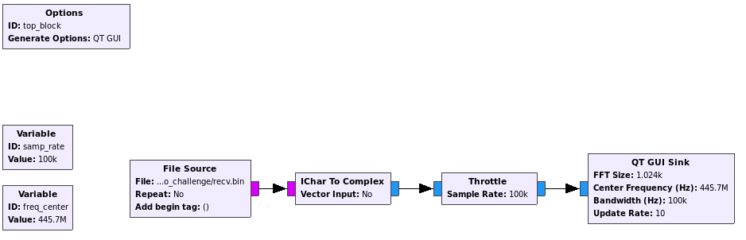
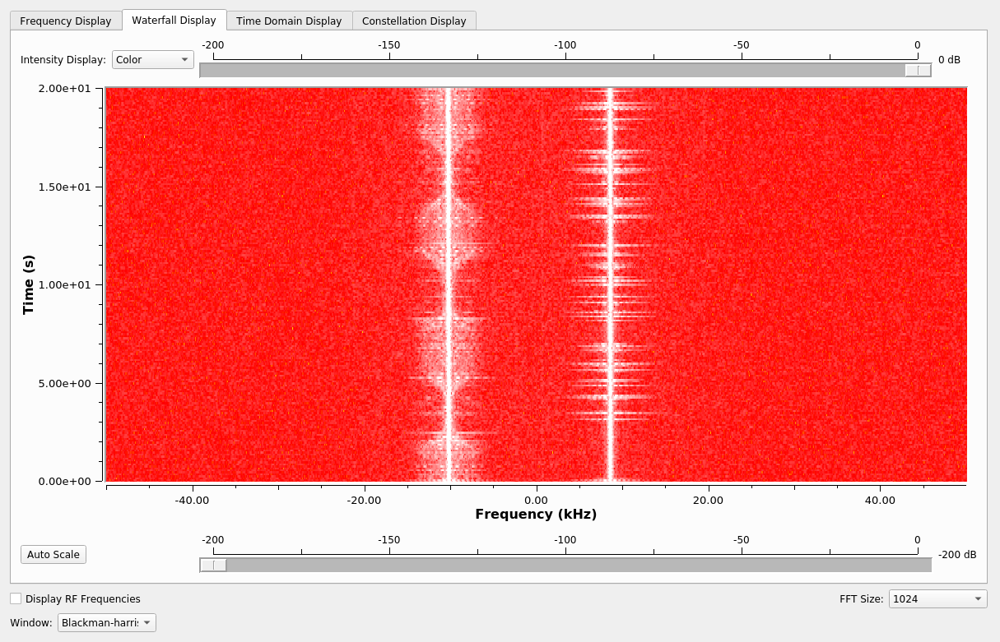
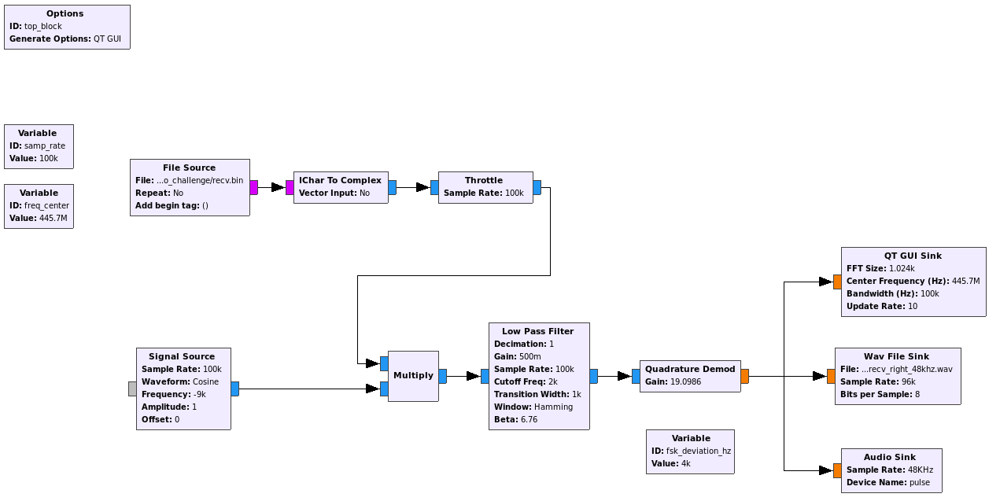

# Midnight Sun CTF 2020 Qualifier - Radio Intercept
> We recorded some strange signals, can you help us decode them?

Download: [https://s3-eu-west-1.amazonaws.com/2020.midnightsunctf.se/865100d0d994d6fd36c3a398c46528f93a0069dd2f613c50955ffe47ca452e6b/radio_challenge.tgz](https://s3-eu-west-1.amazonaws.com/2020.midnightsunctf.se/865100d0d994d6fd36c3a398c46528f93a0069dd2f613c50955ffe47ca452e6b/radio_challenge.tgz)

Points: 228

Solves: 18

Tags: misc, forensic, radio

## Initial steps
We unpack the provided archive. We find a .bin file and a screenshot:



This looks like gnuradio! I assume the bin file is the one written with the File Sink.

## Analysing recv.bin
The next step is clear: Build a flow graph in gnuradio that can read the file and output it to a GUI sink to analyze it further:



We can see the following waterfall diagram:



There seem to be two different signals. The right one is offset by roughly 9kHz. Let's try to extract it. I learned that I can do that by multiplying the signal with a cosine and low pass filtering the rest away. 

Notes: 
- SignalSource.Frequency = -1*our offset = -9k
- Wav File Sink to be able to use the result in Audacity
- To make it more understandable:
  - Reduced the **Gain** in Low Pass Filter and Demod
  - Increase **Cutoff Freq** and **Transition Width**. They should fit the signal width in the waterfall diagram
  - High sample rate in Wav File Sink



Then I opened the resulting .wav file in audacity and listened to it, playing around with the playback speed so I can understand it clearly.

After quite some time I finally found which radio alphabet these weird words could belong to: [https://en.wikipedia.org/wiki/PGP_word_list](https://en.wikipedia.org/wiki/PGP_word_list)

I then transcribed all the words:

```
goggles guitarist flytrap headwaters gazelle graduate frighten hydraulic kickoff enterprise gremlin hazardous fracture hydraulic gazelle hazardous fracture hurricane eyetooth decadence glucose hesitate frighten frequency eyetooth december highchair frequency inverse hemisphere eyetooth guitarist hockey forever goldfish hemisphere indoors forever fracture headwaters gremlin impartial freedom gravity klaxon
```
Initially I misunderstood some words. However I immediatly assumed each word belonging to one ASCII character and used the word list on Wikipedia to correct the ones that were not correct.

Using this neat [Tool](https://goto.pachanka.org/crypto/pgp-wordlist) we arrive at the flag:
```
midnight{Sometimes_Alpha_Bravo_is_not_enough}
```
